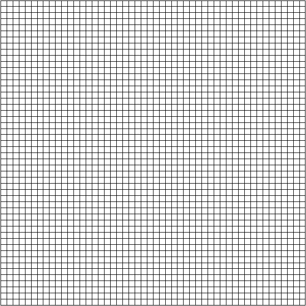
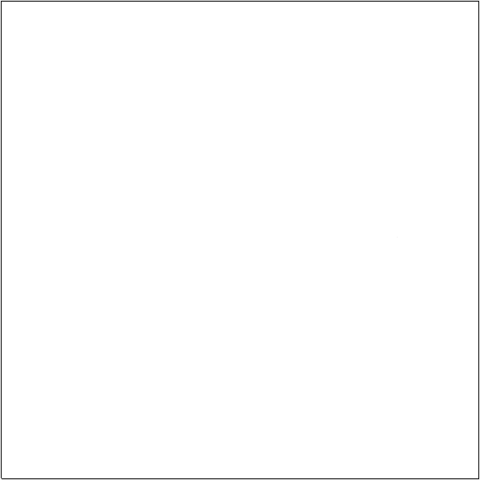
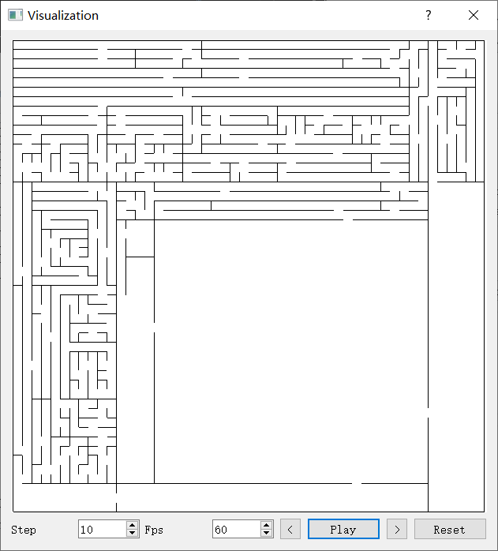

# Maze

Generate maze and its solution using different algorithms.

Maze generation algorithms include:

1. Deep-first search
2. Randomized Kruskal's algorithm
3. Randomized Prim's algorithm
4. Recursive division method

They are all from https://en.wikipedia.org/wiki/Maze_generation_algorithm

Maze solving algorithms include:

1. Wall follower
2. A*

They are all from https://en.wikipedia.org/wiki/Maze_solving_algorithm

## Visualization of generation process

DFS:

Kruskal:

Prim:

Recursive division:

## Screenshots

Maze:

Solution:

Generation algorithm:

Solving algorithm:

Save:

Visualization of generation:

